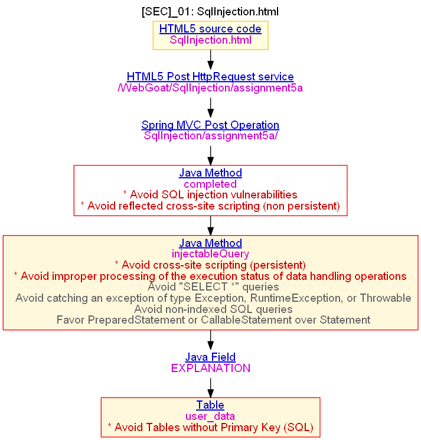
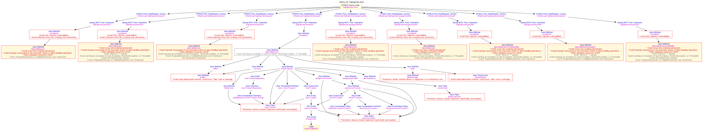
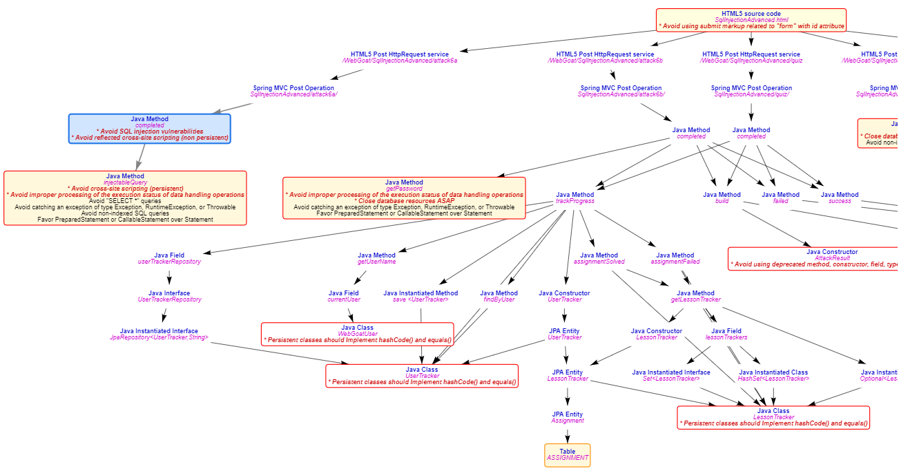
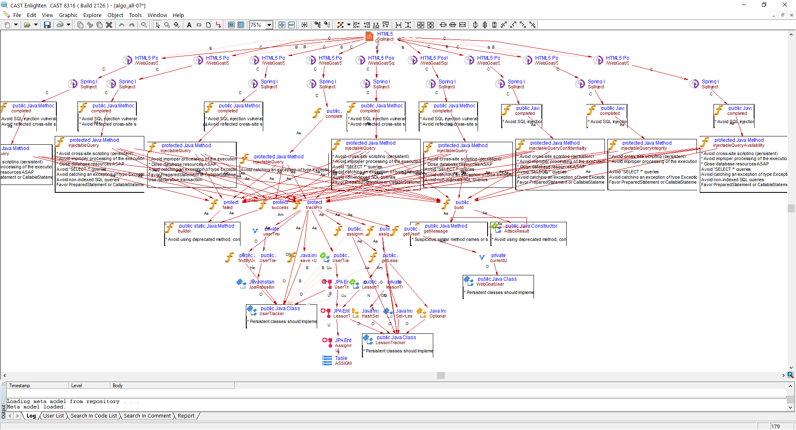

KyT -- Know your transactions
=====================================
KyT is an extenstion to CAST AIP Platform that illustrates risks carried by transactions of already analysed applications.

KyT will render riskiest paths of transactions in PNG or SVG format as well as HTML/JS view, and also will generate CAST Enlighten view. 
Samples of KyT outputs below, using CAST analysis made on OWASP Webgoat application, itself sample application used to test vulnerabilities commonly found in Java: 

Documentation for this CAST Extension can be found in the Wiki section of this site (https://github.com/CAST-Extend/com.castsoftware.uc.kyt/wiki).
